Bots are automated programs that perform tasks on the internet. While some bots, like search engine crawlers, are beneficial, others, like scrapers and spammers, can harm your site.

Bad bots can cause massive problems for web properties. Too much bot traffic can put a heavy load on web servers, slowing or denying service to legitimate users (DDoS attacks are an extreme version of this scenario). Bad bots can also scrape or download content from a website, steal user credentials, take over user accounts, rapidly post spam content, and perform various other kinds of attacks. Bot management is necessary to prevent these performance and security impacts on websites, applications, and APIs, by leveraging a range of security, machine learning, and web development technologies to accurately detect bots and block malicious activity while allowing legitimate bots to operate uninterrupted.

**What are the bot detection techniques?**

Some of the popular bot detection techniques include
- Browser fingerprinting – this refers to information that is gathered about a computing device for identification purposes (any browser will pass on specific data points to the connected website’s servers, such as your operating system, language, plugins, fonts, hardware, etc.) 
- Browser consistency – checking the presence of specific features that should or should not be in a browser. This can be done by executing certain JavaScript requests.
- Behavioral inconsistencies – this involves behavioral analysis of nonlinear mouse movements, rapid button and mouse clicks, repetitive patterns, average page time, average requests per page, and similar bot behavior.
- CAPTCHA – a popular anti-bot measure, is a challenge-response type of test that often asks you to fill in correct codes or identify objects in pictures. 

**Best Practices for Bot Deterrence**
- Create a robots.txt file for your website. A good starting point might be to provide crawling instructions for bots accessing your website's resources. See these examples of Google's robots.txt file.
- Implement CAPTCHAs: Use CAPTCHAs to distinguish between human users and bots.
- Rate Limiting: Set limits on the number of requests a user can make in a given timeframe.
- Regular Monitoring: Continuously monitor traffic and update your security settings to stay ahead of bot activity.
- Set up a web application firewall (WAF). WAFs can be used to filter out suspicious requests and block IP addresses based on various factors
- Use honeypot traps. Honeypots are specifically designed to attract unwanted or malicious bots, allowing websites to detect bots and ban their IP addresses.

**Cloudflare bot solutions**

Cloudflare Bot Solutions offer comprehensive protection against malicious bots that can disrupt your website's performance and security. By leveraging Cloudflare's global network and advanced machine learning algorithms, you can effectively detect and deter unwanted bot traffic, ensuring a seamless experience for your legitimate users.

Key Features:
1. Bot Fight Mode:
- Active Defense: Automatically detects and mitigates bot traffic by deploying challenge-response tests.
- Ease of Use: Simple to enable from the Cloudflare dashboard, providing immediate protection without complex configurations.
2. Bot Management:
- Machine Learning Algorithms: Uses sophisticated machine learning to differentiate between good and bad bots.
- Behavioral Analysis: Monitors traffic patterns to identify and block suspicious activities in real-time.
- Custom Rules: Allows you to create custom rules to address specific bot threats tailored to your business needs.
3. Threat Intelligence:
- Global Insights: Utilizes data from Cloudflare's extensive network to stay ahead of evolving bot threats.
- Updated Databases: Regularly updates bot databases to include new and emerging bot patterns, ensuring up-to-date protection.
4. Analytics and Reporting:
- Detailed Insights: Provides comprehensive analytics and reports on bot traffic, helping you understand the impact and adjust defenses accordingly.
- User-friendly Dashboard: Easy-to-navigate dashboard where you can monitor bot activity and manage your settings.

**How to Implement Cloudflare Bot Solutions**

- Sign Up and Add Your Site:
Create an account on Cloudflare and add your domain. Follow the prompts to configure your DNS settings.
- Enable Bot Fight Mode: Navigate to the Firewall section in the Cloudflare dashboard and toggle on Bot Fight Mode. This feature will start protecting your site immediately.
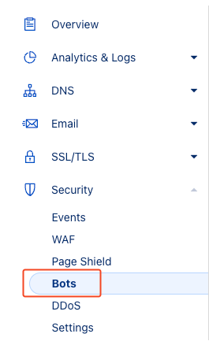

Activate Bot Fight Mode and Block AI Scrapers and Crawlers if not enabled already
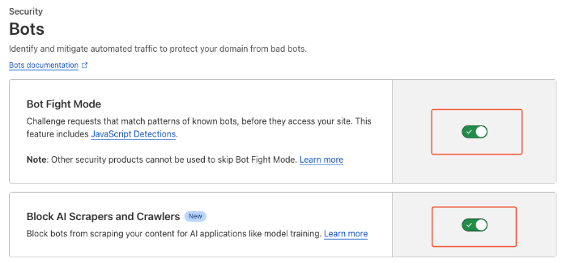

- Configure Bot Management:
Access the Bot Management section to set up advanced rules and customize your bot protection strategy. Use the provided analytics to monitor bot activity and adjust settings as needed.
 - Monitor and Adjust:
Regularly check the Cloudflare dashboard for updates on bot traffic and make necessary adjustments to your bot management rules to keep your site protected against new threats.
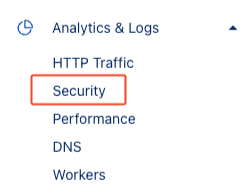
The dashboard gives information about threats and bots identified by Cloudflare
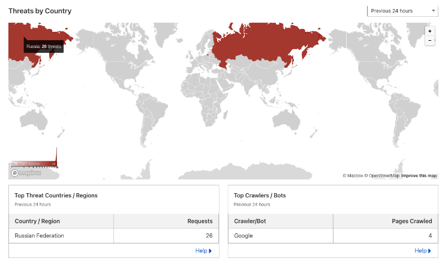

**Bot detection using AWS WAF**

AWS WAF is a web application firewall that helps protect your web applications from common web exploits that could affect application availability, compromise security, or consume excessive resources. With AWS WAF, you can create rules to filter web traffic based on various conditions, including IP addresses, HTTP headers, URI strings, and the origin of the requests.

To begin using AWS WAF, follow these steps:

1. Create a Web ACL (Access Control List):
Navigate to the AWS WAF & Shield console.
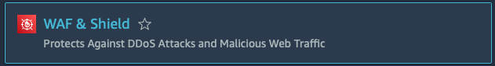
Create a new Web ACL and associate it with your CloudFront distribution, API Gateway, or ALB (Application Load Balancer).
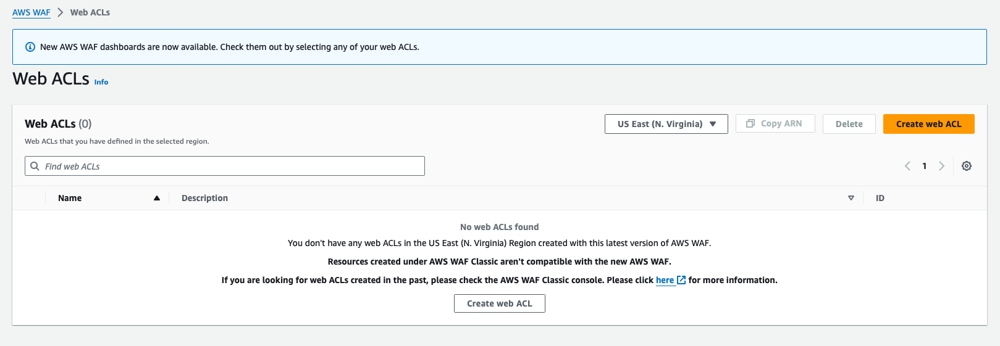
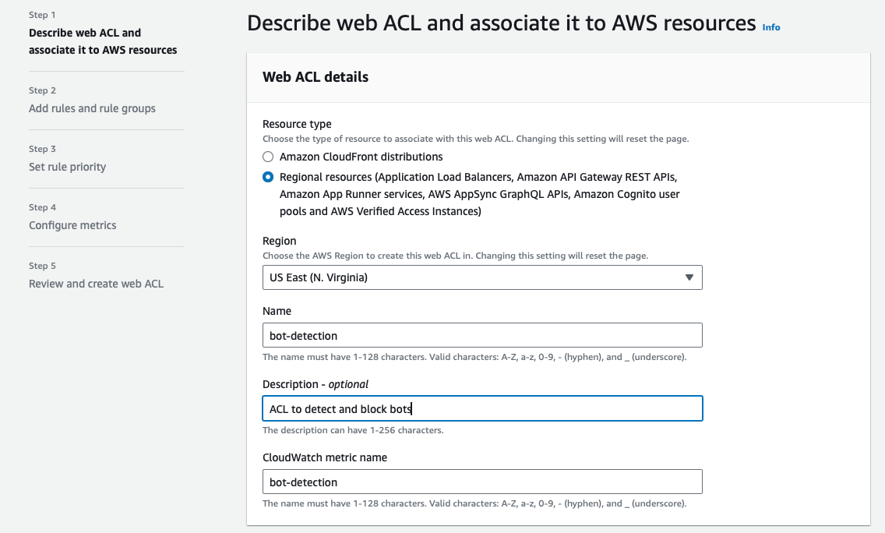
Add AWS resources that needs to be monitored
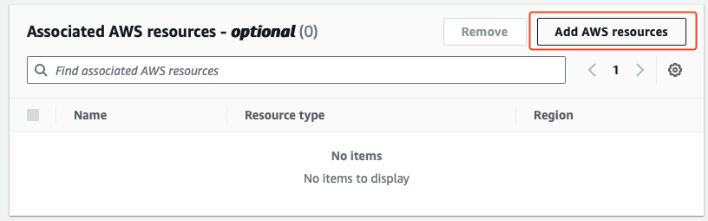
2. Add Rules to Detect Bots:
- User-Agent Filtering: Add a custom rule to inspect the User-Agent header. You can block requests with known bot User-Agent strings or allow only specific User-Agent strings.
- Rate-Based Rules: Use rate-based rules to limit the number of requests from a single IP address. This can help mitigate bots that generate high volumes of traffic.
- AWS Managed Rules: Utilize AWS Managed Rules for bots and scraping detection. AWS offers a Bot Control rule group that specifically targets known bot traffic.
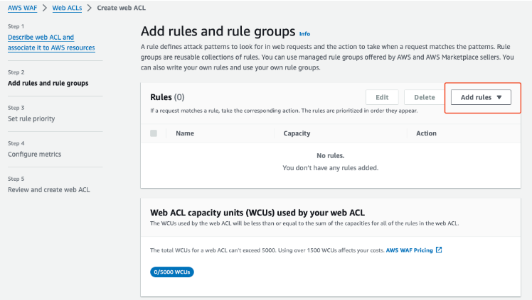
You can choose AWS Managed Rules to begin with and configure to block bots depending on configurations.
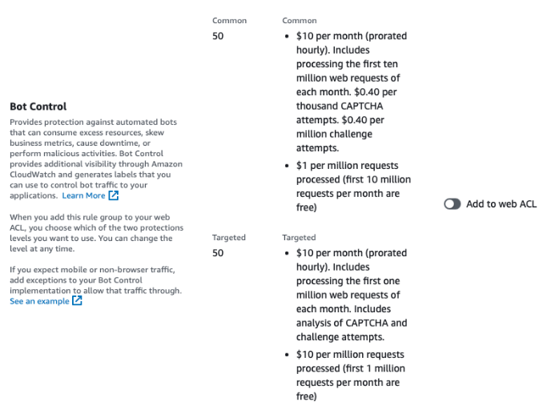

- Click on “Add to web ACL” and edit to add required configurations
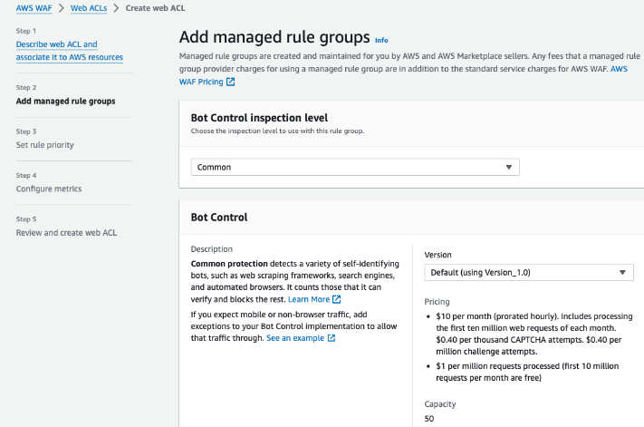
- You can choose multiple categories based on your requirements to block the bots
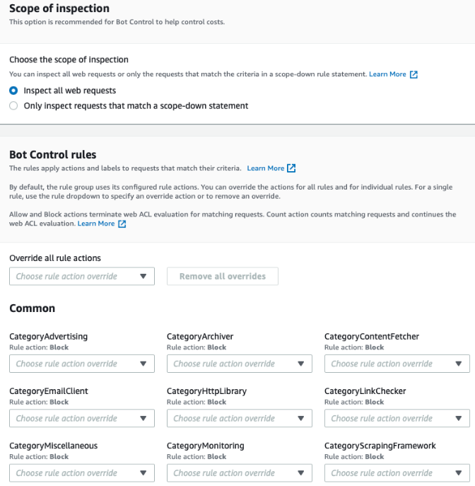
- Once the rules are added, monitoring can be done using the bot control dashboard
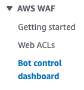

**Boilerplate for robots.txt**

In the below example, currently known AI data scrapers and undocumented AI agents are blocked. You can use it as a starting point and manually customize it as needed.
```
User-agent: Applebot-Extended
Disallow: /


User-agent: Bytespider
Disallow: /


User-agent: CCBot
Disallow: /


User-agent: ClaudeBot
Disallow: /


User-agent: Diffbot
Disallow: /


User-agent: FacebookBot
Disallow: /


User-agent: Google-Extended
Disallow: /


User-agent: GPTBot
Disallow: /


User-agent: Meta-ExternalAgent
Disallow: /


User-agent: omgili
Disallow: /


User-agent: Timpibot
Disallow: /


User-agent: anthropic-ai
Disallow: /


User-agent: Claude-Web
Disallow: /


User-agent: cohere-ai
Disallow: /
```

You can validate robots.txt using [this](https://technicalseo.com/tools/robots-txt/) online service.