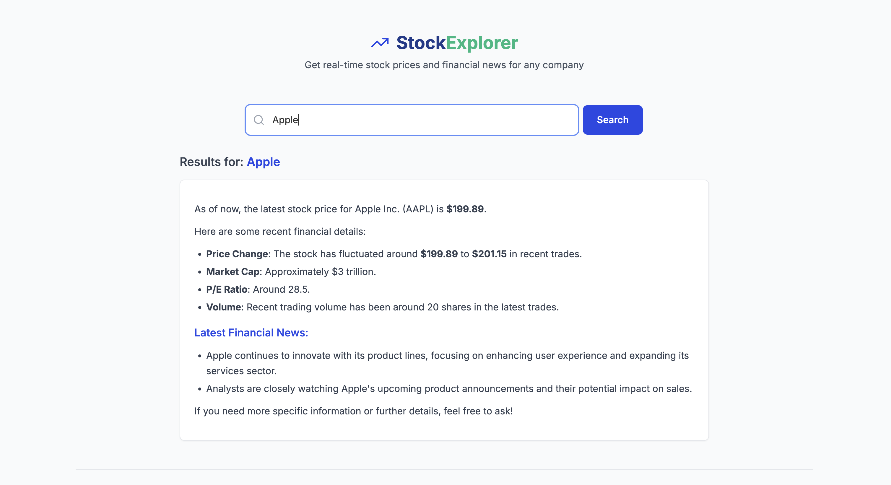

This notebook demonstrates how to build a **real-time stock market explorer** application using [Dappier](https://dappier.com/) and [Bolt.new](https://bolt.new/), a fullstack development platform that lets you generate, run, and deploy applications entirely from the browser—without requiring any local setup.

In this walkthrough, you'll explore:

- **Bolt.new**: An AI-assisted development platform by StackBlitz that enables instant scaffolding of fullstack web apps using natural language prompts. It supports both frontend and backend logic, with built-in support for React, Node.js, Express, and more.
- **Dappier**: A platform that connects LLMs and agentic AI applications to real-time, rights-cleared data from trusted sources. Dappier delivers enriched, prompt-ready data across domains like finance, news, and web search—making it ideal for real-time applications.
- **Real-Time Stock Market App**: A fullstack application where users can enter a stock ticker or company name to retrieve the latest stock price and financial news using the Dappier API.

This setup demonstrates a practical example of how you can leverage Bolt.new and Dappier together to create useful, data-rich applications without complex infrastructure or boilerplate.

## ⚙️ Setup

To get started, follow the steps below to generate your real-time stock market app using **Bolt.new** and **Dappier**.

1. Open [https://bolt.new](https://bolt.new) in your browser.

2. Paste the following prompt exactly as it is into the Bolt.new interface:

```markdown Markdown
# Real-Time Stock Explorer Using Dappier API

Build a fullstack web app using React (frontend) and a pure JavaScript Node.js (Express) backend. The app should allow users to enter a company name or stock ticker and display the latest stock price and financial news using the Dappier API.

## Requirements

**Frontend:**

* Input field for entering a stock ticker or company name
* Submit button
* Render the API response as Markdown

**Backend:**

* POST endpoint at `/api/stock-info`
* Accepts a JSON body with a `query` field
* Constructs a new query string: Latest stock price of {query} and latest financial news.


* Sends a POST request to: https://api.dappier.com/app/aimodel/am_01j749h8pbf7ns8r1bq9s2evrh

* Includes headers:

* `Authorization: Bearer <DAPPIER_API_KEY>` (from `.env`)
* `Content-Type: application/json`
* Request body:

{
    "query": "Latest stock price of Apple and latest financial news."
}

* Returns the API response:

{
    "message": "Markdown-formatted plain text"
}


## Notes

* Use `.env` for `DAPPIER_API_KEY`
* Frontend renders `message` as Markdown
```

3. Click **Submit** and wait for Bolt.new to scaffold your fullstack application.

## 🔑 Setting Up Your Dappier API Key

To enable your application to access real-time financial data, you’ll need to provide your **Dappier API Key**.

Follow the steps below:

1. Visit the Dappier API Key portal:  
   [https://platform.dappier.com/profile/api-keys](https://platform.dappier.com/profile/api-keys)

2. Sign in or create a free account if you don’t already have one.

3. Navigate to **Settings → Profile**, and copy your personal API key.

4. In the Bolt.new project that was generated, locate the `.env` file in the root directory (or create one if it doesn't exist).

5. Paste your API key into the `.env` file using the following format:

    ```env
    DAPPIER_API_KEY=your_api_key_here
    ```

6. Save the file. Your backend will now be authorized to make real-time requests to the Dappier API.

🎉 You're now ready to run your app and explore live stock market data using Dappier!




## 🌟 Highlights

This notebook demonstrated how to build a real-time stock market explorer by combining Bolt.new and Dappier. It provides a fast, browser-based setup that showcases a practical application of AI-generated fullstack apps powered by real-time financial data.

Key tools utilized in this notebook include:

- **Bolt.new**: An AI-assisted development platform that allows developers to create, edit, and deploy fullstack applications directly from the browser with natural language prompts. It supports frameworks like React, Node.js, and Express.
- **Dappier**: A platform connecting LLMs and agentic AI applications to real-time, rights-cleared data from trusted sources, including stock market data, financial news, and web search. It delivers enriched, prompt-ready data ideal for intelligent applications.
- **Real-Time Stock Market App**: A frontend + backend application that takes user input (company name or ticker) and displays live stock price and news, rendered as Markdown from the Dappier API.

This complete example provides a flexible foundation that can be easily adapted for other use cases involving real-time data and dynamic, AI-enhanced interfaces.
