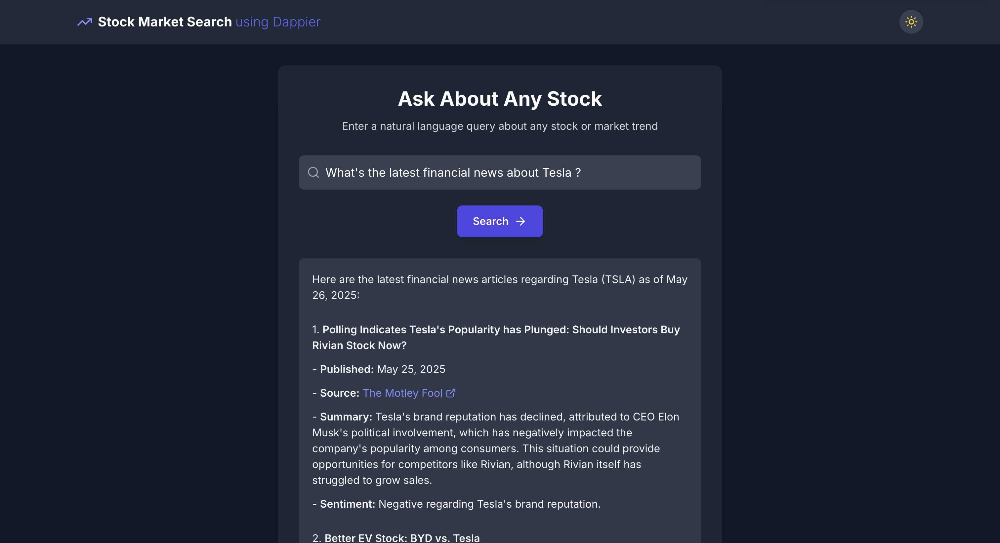

This cookbook demonstrates how to build a **real-time stock market search** application using [Dappier](https://dappier.com/), [Bolt.new](https://bolt.new/), and [Supabase](https://supabase.com/)—a powerful trio that lets you generate, run, and deploy fullstack applications directly from the browser without requiring local setup.

In this walkthrough, you'll explore:

* **Bolt.new**: An AI-assisted development platform by StackBlitz that enables instant scaffolding of fullstack web apps using natural language prompts. It supports both frontend and backend logic, with built-in support for React, Node.js, Express, Supabase Edge Functions, and more.
* **Supabase**: An open-source Firebase alternative offering a scalable backend, database, and serverless Edge Functions. It's ideal for deploying APIs securely and integrating them seamlessly with frontend apps.
* **Dappier**: A platform that connects LLMs and agentic AI applications to real-time, rights-cleared data from trusted sources. Dappier delivers enriched, prompt-ready data across domains like finance, news, and web search—making it ideal for real-time applications.
* **Real-Time Stock Market App**: A frontend + API application where users can enter a stock ticker or company name to retrieve the latest stock price and financial news using Dappier’s AI model, optionally routed through a Supabase Edge Function for deployment on Netlify or Vercel.

This setup demonstrates a practical example of how you can leverage Bolt.new, Supabase, and Dappier together to create useful, data-rich applications without complex infrastructure or boilerplate.

## 🔍 Live Demo

Want to see the app in action?

👉 **Explore the live real-time stock market search here:**
[https://majestic-capybara-e9b31d.netlify.app/](https://majestic-capybara-e9b31d.netlify.app/)

This deployment is powered by **Bolt.new**, **Supabase Edge Functions**, and **Dappier** — delivering real-time financial insights with a production-ready UI. Try entering stock queries like:

* `What’s happening with AAPL today?`
* `Show me the latest on TSLA`
* `Stock news and price of NVIDIA`

This is your AI-powered financial assistant, live and working in the browser.

## 🚀 Getting Started: From Prompt to Deployment

To build and deploy your real-time stock market app using **Bolt.new** and **Dappier**, follow these structured steps:

### 🧾 Step 1: Generate the Frontend App on Bolt.new

1. Open [https://bolt.new](https://bolt.new) in your browser.
2. Paste the following prompt exactly as it is into the Bolt.new interface:

```markdown
Create a beautiful frontend-only web app called "Stock Market Search using Dappier".

The app should have:
- A centered input field that accepts natural language stock queries (e.g., "What’s going on with AAPL today?")
- A bold, animated "Search" button below the input
- On click, show a styled Markdown-formatted AI response (use placeholder content for now)

UI design:
- Full-height responsive layout
- Clean, centered container with a blurred background
- Smooth animations for input focus, button press, and content transitions
- Rounded corners, soft shadows, and elegant hover effects
- Use a readable sans-serif font like Inter or SF Pro
- Dark mode by default with a light mode toggle
- Include a loading spinner while waiting for the Dappier AI

The interface should feel like a premium financial assistant — intuitive, modern, and production-ready.
```

3. Click **Submit** and wait for Bolt.new to scaffold your frontend application.

### 🔗 Step 2: Connect Bolt.new with Supabase

Once your frontend application is scaffolded, follow these steps to link it with your Supabase backend:

1. In the **Bolt.new** interface, click on the **Integrations** button located in the top-right corner of the screen.
2. From the available integrations, select **Supabase**.
3. Authenticate with your Supabase account if prompted.
4. Grant access to your **organization** and select the appropriate **Supabase project** from the list.

This connection will allow you to deploy serverless functions (Edge Functions) and access Supabase-managed environment variables directly from your Bolt.new workspace.

### ⚙️ Step 3: Create a Supabase Edge Function for Real-Time Search

Now that your frontend is ready and connected to Supabase, use the following prompt in **Bolt.new** to generate the backend logic:

````markdown
The interface should feel premium, intuitive, and visually polished — like a product-ready financial assistant.

Create a Supabase Edge Function called `stockSearch` that calls the Dappier Stock Market Search API.

## Behavior:
- Accepts a POST request with JSON payload: `{ "query": "<string>" }`
- Extracts the `query` from the request body
- Calls the Dappier API:

  POST https://api.dappier.com/app/aimodel/am_01j749h8pbf7ns8r1bq9s2evrh  
  Headers:
    - Authorization: Bearer (from environment variable `DAPIER_API_KEY`)
    - Content-Type: application/json  
  Body:
    ```json
    {
      "query": "<string>"
    }
    ```

- Returns the full JSON response from Dappier as-is: `{ "message": "<string>" }`
- Display the Dappier AI response on frontend instead of mocked response.
````

Once submitted, Bolt.new will scaffold the `stockSearch` Edge Function within your Supabase project.
You can now wire your frontend to call this function and render the live results from Dappier.

### 🔐 Step 4: Configure Your Dappier API Key

To authorize your Supabase Edge Function to access real-time financial data from Dappier, you need to generate and securely store your API key.

Follow these steps:

1. Go to the Dappier API Key Portal:
   👉 [https://platform.dappier.com/profile/api-keys](https://platform.dappier.com/profile/api-keys)

2. Sign in or create a free account.

3. Copy your personal **API Key** from the **Settings → Profile** page.

4. In your Supabase dashboard:

   * Navigate to your connected project.
   * Go to **Functions → Edge Functions**.
   * Open the **Secrets** tab.
   * Add a new secret with the key:

     ```
     DAPIER_API_KEY
     ```

     and paste your API key as the value.

5. Save the secret and redeploy your Edge Function if needed.

This ensures your function can securely authenticate requests to the Dappier API.

### 🚀 Step 5: Deploy with One Click

Once your frontend and Supabase Edge Function are set up:

1. In **Bolt.new**, click the **Deploy** button located at the top-right corner of the editor.

2. Bolt will automatically build and deploy your app to **Netlify**.

3. After deployment, you’ll see a link to **Claim your app on Netlify** — click it to connect the project to your Netlify account and manage it going forward.

That’s it! Your real-time stock search is now live and powered by Dappier + Supabase.



## 🌟 Highlights

This cookbook demonstrated how to build a real-time stock market search by combining **Bolt.new**, **Supabase**, and **Dappier**. It provides a fast, browser-based setup that showcases a practical application of AI-generated fullstack apps powered by real-time financial data.

Key tools utilized in this cookbook include:

* **Bolt.new**: An AI-assisted development platform that allows developers to create, edit, and deploy fullstack applications directly from the browser with natural language prompts. It supports frameworks like React, Node.js, Express, and Supabase Edge Functions.
* **Supabase**: An open-source backend platform that enables secure, serverless function execution via Edge Functions. Used here to route real-time queries to Dappier's API with proper authentication and scalable deployment.
* **Dappier**: A platform connecting LLMs and agentic AI applications to real-time, rights-cleared data from trusted sources, including stock market data, financial news, and web search. It delivers enriched, prompt-ready data ideal for intelligent applications.
* **Real-Time Stock Market App**: A frontend + Edge Function application that takes user input (company name or ticker) and displays live stock price and news, rendered as Markdown from the Dappier API.

This complete example provides a flexible foundation that can be easily adapted for other use cases involving real-time data, serverless backends, and dynamic, AI-enhanced interfaces.

