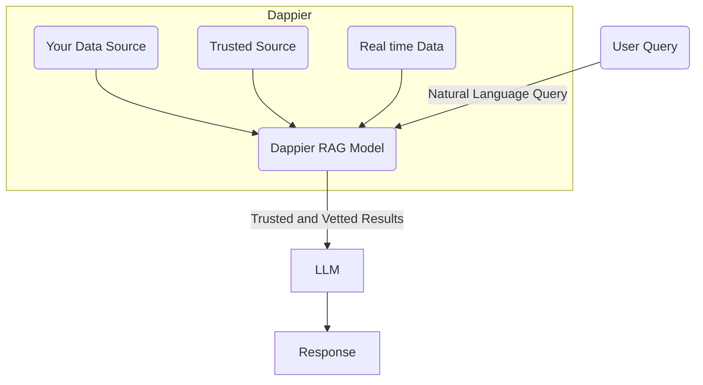

Supercharge your AI applications with Dappier's pre-trained, LLM ready RAG models and natural language APIs to ensure factual, up-to-date, responses from premium content providers across key verticals like News, Finance, Sports, Weather, and more.

[Dappier Marketplace](https://marketplace.dappier.com) includes all the data models that are vetted by dappier.

## How it works

This flowchart shows how Dappier's RAG Model works. Data flows from three sources—Your Data Source, Trusted Sources, and Real-Time Data—into Dappier's RAG Model. A user query is processed by Dappier, which uses the combined data to generate trusted, vetted results. These results are then passed to an LLM, which produces the final response, ensuring reliable and accurate output for any application.

