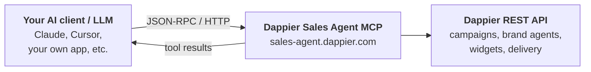

The **Dappier Sales Agent MCP** lets marketers use AI agents to create conversational **Brand Agents** and launch advertising campaigns.

Brand Agents can run across:

- **Dappier Ask AI inventory** across our publisher network
- **Open internet advertising inventory** through existing programmatic buying platforms / DSPs

Using the MCP, AI agents can **discover available inventory, create and launch campaigns, manage campaigns, and pull performance data**.

Dappier Sales Agent is built on the [Advertising Context Protocol (AdCP)](https://adcontextprotocol.org/) and is available at **[sales-agent.dappier.com](https://sales-agent.dappier.com)**.

## Watch the Video

<iframe width="560" height="315" src="https://www.youtube.com/embed/tzjEQMwNPqs?si=QZ_1o7oZ0Zik4OX_" title="YouTube video player" frameborder="0" allow="accelerometer; autoplay; clipboard-write; encrypted-media; gyroscope; picture-in-picture; web-share" referrerpolicy="strict-origin-when-cross-origin" allowfullscreen></iframe>

# What is MCP?

If you've never seen MCP before, here's the mental model:



- The **server** advertises tools (name + JSON schema + description).
- The **client** fetches that list and lets the LLM call any tool by name with arguments that match the schema.
- The server validates, executes, and returns a result the LLM can use to continue the conversation.

# What the Sales Agent MCP Server Does

Dappier is a **sales agent on the AdCP `media_buy` protocol**, selling one product: **Sponsored Conversations**.

A sponsored prompt — a clickable suggested question — appears inside publisher AI chat widgets across the Dappier network. When a user clicks it, they enter a full **Brand Agent** conversation: an AI chat experience that answers as the advertiser's brand, grounded in the brand's own content, with follow-up prompts and a call-to-action button.

| Tool | What it does |
|---|---|
| `get_adcp_capabilities` | Versions, protocols, auth/billing model, idempotency semantics, feature flags. |
| `get_products` | The Sponsored Conversations product, its pricing option, and reporting contract. |
| `list_creative_formats` | The full asset specification for the `dappier_brand_agent` format. |
| `create_media_buy` | Creates the brand agent, the campaign, and the branded widget **in one call**. |
| `get_media_buys` | Current campaign state — status, budget, revision token, SmartSync pixel. |
| `update_media_buy` | Pause/resume, change budget, keywords, prompts, and the three image assets. |
| `get_media_buy_delivery` | Lifetime delivery — impressions, clicks, CTR, CTA engagements. |
| `provide_performance_feedback` | Report what the traffic was worth against your own attribution. |

What you get as a developer:

1. An **AI-callable surface** for **Dappier Sponsored Conversations** — the branded prompt suggestions that appear inside publisher AI chat widgets across the Dappier network.
2. **One call to launch.** `create_media_buy` builds the brand agent, the campaign, and the branded chat widget together. There is no separate creative-upload step.
3. **A shareable preview** (`demo_url`) and **two ready-to-traffic activation snippets** returned on that same call.
4. **Delivery reporting** and a **feedback channel** back to Dappier.

What the server is **not**:

- It **does not quote prices**. Sponsored Conversations are flat-rate; the figure is agreed offline with Dappier.
- It **does not activate campaigns.** Every campaign is registered `paused`, with `confirmed_at: null`, pending Dappier trafficking and reviewer activation.
- It **does not honor standard AdCP targeting** (geo, device, language, audience). **Contextual keywords are the only targeting signal** — every campaign runs across the full Dappier network.
- It **has no creative library.** Creatives are inline and package-scoped, not reusable by `creative_id`.
- It **cannot cancel a buy over the API**, and it **cannot change flight dates after creation**.

<Warning>
Earlier versions of this server exposed separate `build_creative` and `list_creatives` tools. Those are **removed** — creative creation is folded into `create_media_buy`, and creative revision into `update_media_buy`.
</Warning>

---

# Getting Started

## Base URLs and Endpoints

The server is hosted by Dappier. Connect using the standard MCP streamable-HTTP transport.

| Transport | Path | When to use |
|---|---|---|
| **Streamable HTTP** | `POST /mcp` | All MCP clients (Claude.ai, Cursor, custom apps, `mcp-remote` proxy). Recommended. |
| **Server-Sent Events** | `GET /sse` | Legacy clients that only speak SSE (e.g. Cloudflare AI Playground). |

Health / discovery endpoints (open, no auth):

| Path | Returns |
|---|---|
| `GET /` | HTML landing page confirming the worker is up. |
| `GET /.well-known/mcp.json` | The AdCP server card (name, version, tool list, protocols). |
| `GET /.well-known/server.json` | Same server card (alias). |

## Authentication

Every MCP request (except `/` and `/.well-known/*` discovery endpoints) requires a **Dappier API key**.

### Query parameter

```
https://sales-agent.dappier.com/mcp?apiKey=YOUR_DAPPIER_API_KEY
```

### HTTP header

```
dappier-api-key: YOUR_DAPPIER_API_KEY
```

If the key is missing you'll get an HTTP `401` with a plain-text body:

```
Authentication required

A Dappier API key is required to access this endpoint.

You can provide it in one of two ways:
  1. Query parameter:  ?apiKey=YOUR_DAPPIER_API_KEY
  2. Request header:   dappier-api-key: YOUR_DAPPIER_API_KEY

Don't have a key yet? Create one at:
  https://platform.dappier.com/profile/api-keys
```

### Getting an API key

Create Dappier API keys at [platform.dappier.com/profile/api-keys](https://platform.dappier.com/profile/api-keys). Keys start with `ak_`. The key is used:

- As a Bearer token on every outbound call the server makes to `api.dappier.com`.
- To authorize the MCP session itself at the edge.

<Warning>
Keep the key server-side or in a secret manager. Never expose it in browser code.
</Warning>

---

# Connecting from Common MCP Clients

## Claude Desktop (via `mcp-remote`)

Claude Desktop speaks MCP over stdio. To reach a remote HTTPS MCP server, proxy through `mcp-remote`.

Edit your Claude Desktop config (**Settings → Developer → Edit Config**):

```json
{
  "mcpServers": {
    "dappier-sales-agent": {
      "command": "npx",
      "args": [
        "mcp-remote",
        "https://sales-agent.dappier.com/mcp?apiKey=YOUR_DAPPIER_API_KEY"
      ]
    }
  }
}
```

Restart Claude Desktop — the 8 Dappier tools will appear in the tool picker.

## Claude.ai (Connectors / Remote MCP)

On [claude.ai](https://claude.ai), add a custom connector / remote MCP server pointing at `https://sales-agent.dappier.com/mcp`. Supply the API key via header (`dappier-api-key`) where the UI allows custom headers, or via `?apiKey=...` in the URL otherwise.

## Cursor

Add a remote MCP server in Cursor's MCP settings pointing at:

```
https://sales-agent.dappier.com/mcp?apiKey=YOUR_DAPPIER_API_KEY
```

Cursor supports the streamable HTTP transport directly.

## Cloudflare AI Playground

Go to [playground.ai.cloudflare.com](https://playground.ai.cloudflare.com/) and enter this as the server URL:

```
https://sales-agent.dappier.com/sse?apiKey=YOUR_DAPPIER_API_KEY
```

## Custom Node.js Client

Any client built on `@modelcontextprotocol/sdk` can connect over streamable HTTP:

```ts TypeScript
import { Client } from "@modelcontextprotocol/sdk/client/index.js";
import { StreamableHTTPClientTransport } from "@modelcontextprotocol/sdk/client/streamableHttp.js";

const transport = new StreamableHTTPClientTransport(
  new URL("https://sales-agent.dappier.com/mcp"),
  {
    requestInit: {
      headers: { "dappier-api-key": process.env.DAPPIER_API_KEY! }
    }
  }
);

const client = new Client(
  { name: "my-app", version: "1.0.0" },
  { capabilities: {} }
);
await client.connect(transport);

const tools = await client.listTools();
console.log(tools);

const products = await client.callTool({
  name: "get_products",
  arguments: {
    buying_mode: "brief",
    brief: "Launch a new coffee brand in Q3"
  }
});
console.log(products);
```

## Anthropic SDK (Native MCP Connector)

The Claude Messages API can call a remote MCP server directly as a tool-use source — no separate MCP client SDK required:

```python Python
client.beta.messages.create(
    model="claude-opus-5",
    max_tokens=16000,
    betas=["mcp-client-2025-11-20"],
    mcp_servers=[{
        "type": "url",
        "url": "https://sales-agent.dappier.com/mcp",
        "name": "dappier-sales-agent",
        "authorization_token": "YOUR_DAPPIER_API_KEY",
    }],
    tools=[{
        "type": "mcp_toolset",
        "mcp_server_name": "dappier-sales-agent",
    }],
    messages=[{
        "role": "user",
        "content": "List my active Dappier campaigns."
    }],
)
```

<Note>
Both halves are required — `mcp_servers` alone is rejected as a validation error. The `mcp_server_name` in `tools` must match the `name` in `mcp_servers`.
</Note>

---

# Server Discovery

`GET /.well-known/mcp.json` (and `/.well-known/server.json`) returns:

```json
{
  "name": "com.dappier/sales-agent",
  "version": "1.0.0",
  "title": "Dappier Sales Agent",
  "description": "AdCP sales agent for Dappier's Sponsored Conversations network — discover inventory, create and manage branded-prompt campaigns across Dappier's publisher AI chat widgets.",
  "tools": [
    { "name": "get_adcp_capabilities", "description": "..." },
    { "name": "get_products", "description": "..." },
    { "name": "list_creative_formats", "description": "..." },
    { "name": "create_media_buy", "description": "..." },
    { "name": "update_media_buy", "description": "..." },
    { "name": "get_media_buy_delivery", "description": "..." },
    { "name": "get_media_buys", "description": "..." },
    { "name": "provide_performance_feedback", "description": "..." }
  ],
  "_meta": {
    "adcontextprotocol.org": {
      "protocols_supported": ["media_buy"]
    }
  }
}
```

<Note>
Only `media_buy` is declared. `list_creative_formats` is a Creative Protocol task, but the spec lists it in the media-buy sales agent's required set — implementing it does not oblige a `creative` claim, and none of the creative-lifecycle tasks are implemented.
</Note>

---

# Conventions

## Response envelope

Every tool returns an MCP `CallToolResult` with two fields:

- `content[0]` — a `text` block containing pretty-printed JSON (for LLMs reading the text).
- `structuredContent` — the same payload as a machine-readable object (for programmatic clients).

Both contain the same data — use whichever matches your client.

Inside that payload, every response carries the AdCP envelope:

```json
{
  "adcp_version": "3.1",
  "adcp_major_version": 3,
  "status": "completed"
}
```

`status` is `"completed"` on success and `"failed"` on error. Reads and writes alike complete synchronously — this agent never returns a pending task.

## Idempotency

`idempotency_key` is **required** on the three tools with side effects — `create_media_buy`, `update_media_buy`, and `provide_performance_feedback` — and accepted-but-ignored on the read tools.

- Format: 16–255 characters of letters, digits, and `_ . : -` only. Use a UUID v4.
- Retrying with the **same key** replays the original response, and the response carries `replayed: true`.
- A **fresh key always creates a new campaign and a new brand agent.** This is the most common way duplicate buys get made.
- Replay window: **24 hours** (`replay_ttl_seconds: 86400`).

| Code | What it means |
|---|---|
| `IDEMPOTENCY_CONFLICT` | Same key, different request body. Resend the original body, or mint a fresh key for the new one. |
| `IDEMPOTENCY_IN_FLIGHT` | The original call is still running. Wait and retry with the **same** key. |
| `IDEMPOTENCY_EXPIRED` | Past the replay window. Check whether the original call succeeded before minting a new key. |

## Optimistic concurrency (`revision`)

`update_media_buy` requires the `revision` you last observed via `get_media_buys`. It is checked atomically; a stale value returns `CONFLICT` and changes nothing. Re-read the buy and retry with the current revision **and a fresh `idempotency_key`**.

## The `account` object

`account` is a strict **one-of**. Send **either** `{ account_id }` **or** `{ brand, operator }` — never fields from both, which is rejected rather than reconciled.

```json
{
  "account": {
    "brand": { "domain": "northwindcoffee.com" },
    "operator": "agencytradingdesk.com"
  }
}
```

Most callers use `{ brand, operator }`; no prior setup call is needed. `operator` is the entity placing the buy on the brand's behalf — an agency trading desk, or the brand's own domain when buying direct.

`account` is **required** on `create_media_buy` and `update_media_buy`, and optional on the reads.

## Brand identity is a domain

AdCP identifies advertisers by domain, not by company name. Dappier resolves the display name and description from the domain's `/.well-known/brand.json` where available, falling back to your `brief` and then to a name derived from the domain.

## ID prefixes

| Prefix | Meaning | Example |
|---|---|---|
| `cp_` | Campaign / media buy id (also the package id) | `cp_01HW9ZAB...` |
| `am_` | Brand Agent id (returned as `creative_assignments[].creative_id`) | `am_01HW9CD...` |
| `pl_` | Brand-agent placement id | `pl_01HW9EF...` |
| `ak_` | Dappier API key | `ak_...` |

## Context passthrough

`create_media_buy`, `update_media_buy`, and the read tools accept a `context: Record<string, unknown>` field, echoed back unchanged on the response — useful for correlating tool calls with your own session state. Packages carry their own `context` too, so you can map Dappier's `package_id` onto your own line item.

## Error shape

Errors follow AdCP 3.1:

```json
{
  "adcp_version": "3.1",
  "adcp_major_version": 3,
  "status": "failed",
  "errors": [
    {
      "code": "VALIDATION_ERROR",
      "message": "keyword_targets is required — contextual keywords are the only targeting signal Sponsored Conversations honor.",
      "recovery": "correctable",
      "field": "packages[0].targeting_overlay.keyword_targets",
      "suggestion": "Supply entries like { \"keyword\": \"coffee subscription\", \"match_type\": \"broad\" }."
    }
  ],
  "message": "1 validation error. No media buy was created."
}
```

Every error carries a **`recovery`** hint — the field that tells a buying agent whether to retry:

| `recovery` | Meaning |
|---|---|
| `transient` | Retry helps. Reuse the same `idempotency_key`. |
| `correctable` | Fix the request body and resend. |
| `terminal` | Never retry — this will fail identically every time. |

### Error code reference

| Code | Meaning | Typical recovery |
|---|---|---|
| `VALIDATION_ERROR` | Field missing, blank, or malformed. | `correctable` |
| `UNSUPPORTED_FEATURE` | Well-formed, but asks for something Dappier does not offer. | `correctable` |
| `TERMS_REJECTED` | Buyer-proposed delivery/measurement terms are not negotiated here. | `correctable` |
| `VERSION_UNSUPPORTED` | `adcp_major_version` not supported. Currently supported: `3`. | `correctable` |
| `CONFLICT` | Stale `revision` on update. Re-read and retry. | `correctable` |
| `IDEMPOTENCY_CONFLICT` / `IDEMPOTENCY_IN_FLIGHT` / `IDEMPOTENCY_EXPIRED` | See [Idempotency](#idempotency). | varies |
| `MEDIA_BUY_NOT_FOUND` | Unknown `cp_xxxx`, or one belonging to another account. | `correctable` |
| `NOT_CANCELLABLE` | `canceled: true` on update — Dappier does not cancel over the API. | `correctable` |
| `DATE_RANGE_NOT_SUPPORTED` | `start_date` / `end_date` on delivery — reporting is lifetime-only. | `correctable` |
| `AUTH_INVALID` | 401 — bad or missing API key. | `terminal` |
| `POLICY_VIOLATION` | 403 — insufficient scope. | `terminal` |
| `INVALID_STATE` | 409 — e.g. resuming a campaign Dappier has not yet trafficked. | `terminal` |
| `CONFIGURATION_ERROR` | 404 on the backend endpoint itself — a deployment fault. | `terminal` |
| `RATE_LIMITED` | 429. | `transient` |
| `INTERNAL_ERROR` / `SERVICE_UNAVAILABLE` | 5xx or no response. | `transient` |

<Note>
Field paths in errors are translated into **your** request's vocabulary — you get `packages[0].creatives[0].assets.cta_url`, not the backend's internal `campaign.cta_link`.
</Note>

## Typical campaign lifecycle

```
1. get_adcp_capabilities              — discover versions, protocols, feature flags
2. get_products                       — get product_id + pricing_option_id
3. list_creative_formats              — get the full asset spec for dappier_brand_agent
4. create_media_buy                   — brand agent + campaign + widget in one call
                                        → cp_xxxx, paused, confirmed_at: null
                                        → demo_url, distribution, platform_links
5. [traffic the SmartSync pixel and/or the standalone creative in your DSP]
6. [Dappier trafficking + reviewer activation]
7. update_media_buy { paused: false } — activate (stamps confirmed_at)
8. get_media_buys                     — check state, read the current revision
9. get_media_buy_delivery             — lifetime impressions / clicks / CTR / engagements
10. provide_performance_feedback      — report what that traffic was worth to you
```

---

# Tools Reference

## `get_adcp_capabilities`

**Purpose:** The first call a buyer should make. Tells you which AdCP versions Dappier speaks, which protocols it implements, the auth and billing model, idempotency semantics, and per-protocol feature flags.

**Network behavior:** In-memory lookup. No outbound call. Returns instantly.

### Inputs (all optional)

| Field | Type | Description |
|---|---|---|
| `adcp_major_version` | integer | AdCP major version your payloads conform to. Currently supported: `3`. An unsupported value returns `VERSION_UNSUPPORTED` along with the list that is supported. |
| `protocols` | array of `"media_buy" \| "creative" \| "signals" \| "governance" \| "brand" \| "sponsored_intelligence"` | Restrict the response to specific protocols. Asking for one Dappier does not support returns an empty `supported_protocols` rather than an error. |
| `idempotency_key` | string | Accepted and ignored — this call has no side effects. |

### Success response

```json
{
  "adcp_version": "3.1",
  "adcp_major_version": 3,
  "status": "completed",
  "adcp": {
    "major_versions": [3],
    "supported_versions": ["3.1"],
    "idempotency": { "supported": true, "replay_ttl_seconds": 86400 }
  },
  "supported_protocols": ["media_buy"],
  "specialisms": ["sales-non-guaranteed"],
  "account": {
    "require_operator_auth": false,
    "supported_billing": ["operator", "agent"]
  },
  "media_buy": {
    "features": {
      "inline_creative_management": true,
      "property_list_filtering": false
    },
    "supports_proposals": false
  },
  "creative": {
    "has_creative_library": false,
    "supports_transformers": false
  },
  "request_signing": { "supported": false },
  "compliance_testing": { "supported": false }
}
```

<Note>
`inline_creative_management: true` is what makes `packages[].creatives` a legal input. `has_creative_library: false` is what makes it the *only* way to supply a creative — there is no `sync_creatives` step and no reuse by `creative_id`.
</Note>

---

## `get_products`

**Purpose:** Discover what Dappier sells. Call this before `create_media_buy` — it returns the `product_id` and `pricing_option_id` a media buy requires.

**Network behavior:** In-memory. No API call.

### Two buying modes

| Mode | Behavior |
|---|---|
| `brief` (default) | Describe the campaign in natural language via `brief`. Returns the product with a `brief_relevance` note. `brief` is **required**. |
| `wholesale` | Read the raw product feed. `brief` **must be omitted**. Returns `wholesale_feed_version` and `cache_scope`. |

`refine` mode is **not supported** — this agent publishes a single product and issues no proposals.

### Inputs

| Field | Type | Notes |
|---|---|---|
| `buying_mode` | `"brief" \| "wholesale"` | Defaults to `brief`. |
| `brief` | string | Required in `brief` mode, forbidden in `wholesale` mode. |
| `brand.domain` | string | E.g. `"northwindcoffee.com"`. Optional at discovery. |
| `brand.brand_id` | string | Sub-brand identifier. |
| `account` | object | Account-specific rate cards. Dappier publishes one public rate card, so this changes nothing today. |
| `filters.delivery_type` | `"guaranteed" \| "non_guaranteed"` | Sponsored Conversations are `non_guaranteed`. |
| `filters.is_fixed_price` | boolean | Flat-rate counts as fixed price; `false` excludes the product. |
| `filters.pricing_currencies` | `string[]` | Dappier prices in `USD`. |
| `filters.channels` | `string[]` | Dappier inventory is on the **`sponsored_intelligence`** channel. |
| `filters.format_ids` | `{ agent_url, id }[]` | Entries are objects, never bare strings. |
| `if_wholesale_feed_version` | string | Conditional read. If nothing changed you get `unchanged: true` with no products. |

<Warning>
**Filters never error.** A filter this product cannot satisfy returns an empty `products` array, not a failure — so you can fan out across many sellers and read the empty result as "no match here".
</Warning>

### Success response

```json
{
  "adcp_version": "3.1",
  "status": "completed",
  "products": [{
    "product_id": "sponsored_conversations",
    "name": "Sponsored Conversations",
    "description": "A branded prompt suggestion that appears inside publisher AI chat widgets across the Dappier network...",
    "channels": ["sponsored_intelligence"],
    "publisher_properties": [
      { "publisher_domain": "dappier.com", "property_tags": ["dappier_network"] }
    ],
    "format_ids": [{
      "agent_url": "https://sales-agent.dappier.com",
      "id": "dappier_brand_agent"
    }],
    "delivery_type": "non_guaranteed",
    "pricing_options": [{
      "pricing_option_id": "contact_sales",
      "pricing_model": "flat_rate",
      "currency": "USD",
      "min_spend_per_package": 0
    }],
    "reporting_capabilities": {
      "available_metrics": ["impressions", "clicks", "ctr", "engagements"],
      "date_range_support": "lifetime_only",
      "expected_delay_minutes": 1
    },
    "brief_relevance": "Strong fit — ..."
  }],
  "pagination": { "has_more": false, "total_count": 1 }
}
```

<Note>
`brief_relevance` is present only in `brief` mode. `available_metrics` is a binding contract — `spend` is deliberately absent because Sponsored Conversations are flat-rate with no per-impression rate to meter.
</Note>

---

## `list_creative_formats`

**Purpose:** Get the full asset specification for Dappier's creative format. Call this before `create_media_buy` — it tells you exactly which assets a brand agent needs.

**Network behavior:** In-memory. Instant.

Dappier publishes **one format**, `dappier_brand_agent`. It is not a banner or a video: it is a conversational brand agent, so its assets are a persona, knowledge sources, promoted questions, a call-to-action, and widget branding.

### Inputs (all optional)

| Field | Type | Notes |
|---|---|---|
| `format_ids` | `{ agent_url, id }[]` | Entries are objects, never bare strings. |
| `asset_types` | `string[]` | OR logic. This format uses `text`, `url`, and `image`. |
| `name_search` | string | Case-insensitive partial match on the format name. |
| `max_width`, `max_height`, `min_width`, `min_height` | integer | **Any dimension filter excludes this format** — it renders inside a publisher's chat widget and declares no fixed renders. |
| `is_responsive` | boolean | |
| `wcag_level` | `"A" \| "AA" \| "AAA"` | |
| `pagination.max_results`, `pagination.cursor` | | One format, so responses are always terminal. |

### The `dappier_brand_agent` asset spec

**Individual assets** — supplied by `asset_id`:

| Asset | Type | Required | Max length | Notes |
|---|---|---|---|---|
| `agent_name` | text | yes | 120 | Display name, written as a product name. |
| `agent_description` | text | yes | 500 | Internal metadata for reviewers; not shown to end users. |
| `persona` | text | yes | — | **The most important field.** The system prompt for every answer. |
| `welcome_title` | text | yes | 60 | Default to exactly `Ask [Brand Name]!` |
| `welcome_description` | text | yes | **60** | Hard limit. Over-length is rejected, not truncated. |
| `primary_color` | text | yes | — | Hex, `rgb()`, or a CSS color name. |
| `cta_button_text` | text | yes | 24 | Short and imperative. |
| `cta_url` | url | yes | — | Deep-link to the relevant page, not the homepage. |
| `logo` | image | **recommended** | — | Widget header mark. Missing → Dappier's default mark. |
| `banner_image` | image | **recommended** | — | Advertiser banner at the top of the widget. Missing → banner slot off. |
| `sponsored_prompt_thumbnail` | image | **recommended** | — | One square image shared by **every** sponsored prompt. Missing → no thumbnail. |

**Repeatable groups** — flattened to zero-indexed keys of the form `{group}_{index}_{asset}`, **not nested arrays**:

| Group | Count | Keys | Notes |
|---|---|---|---|
| `sponsored_prompt` | **3 – 10** | `sponsored_prompt_0_text` | The ad units. Only the first 3 render — order strongest first. Max 120 chars each. |
| `followup_prompt` | **6 – 10** | `followup_prompt_0_text` | In-chat suggestions. Never backfilled. Max 120 chars each. |
| `knowledge_source` | 0 – 25 | `knowledge_source_0_url` + `knowledge_source_0_kind` | `kind` is one of `rss`, `webpage`, `graphql`. Both keys required per index. |

<Warning>
Indices must **start at 0 and be contiguous**, and all keys for one index must be supplied together. `min_count` and `max_count` are enforced — fewer than 3 sponsored prompts or fewer than 6 follow-ups is rejected.
</Warning>

Asset **values are always objects**, never bare strings:

```json
{
  "persona":     { "content": "..." },
  "cta_url":     { "url": "https://..." },
  "logo":        { "url": "https://...", "width": 512, "height": 512 }
}
```

---

## `create_media_buy`

**Purpose:** Create a Sponsored Conversations campaign. **One call creates the brand agent, the campaign, and the branded chat widget together.** There is no separate creative-upload step.

<Warning>
**The result is not live.** The campaign is registered `paused` pending Dappier trafficking and reviewer activation, and `confirmed_at` comes back `null` because Dappier has not yet committed to the buy. Report it as *registered and pending activation* — never as live or serving.
</Warning>

### Top-level inputs

| Field | Type | Required | Notes |
|---|---|---|---|
| `account` | one-of `{ account_id }` or `{ brand, operator }` | **yes** | See [The `account` object](#the-account-object). |
| `brand.domain` | string | **yes** | The advertiser's website domain. No scheme, no path. |
| `brand.brand_id` | string | no | Sub-brand identifier. |
| `idempotency_key` | string | **yes** | UUID v4, 16–255 chars of `A-Za-z0-9_.:-`. |
| `packages` | `Package[]` | **yes** | **Exactly one.** One media buy = one campaign = one brand agent. |
| `start_time` | `"asap"` or ISO 8601 | no | **Normally omitted.** No start → begins the moment Dappier activates. |
| `end_time` | ISO 8601 | no | **Normally omitted.** No end → never expires. Does not accept `"asap"`. |
| `brief` | string | no | A sentence or two on the brand. Used for contextual matching and as a fallback brand description. |
| `po_number` | string | no | Passed through to Dappier finance. |
| `paused` | boolean | no | Records **your** intent for later. Every campaign is registered paused regardless. |
| `context` | object | no | Echoed back unchanged. |

<Note>
`start_time` and `end_time` are **independent** — you can set an end without a start, or the reverse. Never invent a flight window to fill a field; the response `message` states the actual schedule, so repeat that back.
</Note>

### Package inputs

| Field | Type | Required | Notes |
|---|---|---|---|
| `product_id` | string | **yes** | Always `"sponsored_conversations"`. |
| `pricing_option_id` | string | **yes** | Always `"contact_sales"`. |
| `format_ids[]` | `{ agent_url, id }` | no | Defaults to the product's only format. |
| `budget` | number | no | A plain positive number, e.g. `25000` — **not** an object. Omit if no figure has been agreed. |
| `targeting_overlay.keyword_targets` | `{ keyword, match_type? }[]` | **yes, ≥1** | **The only targeting signal.** `match_type` is `broad` (default), `phrase`, or `exact`. |
| `creatives` | `Creative[]` | **yes** | **Exactly one.** The brand agent, supplied inline. |
| `creatives[0].creative_id` | string | **yes** | Your identifier, e.g. `"northwind_brand_agent_v1"`. |
| `creatives[0].name` | string | **yes** | Human-readable name. |
| `creatives[0].format_id` | `{ agent_url, id }` | no | The format this creative fills. |
| `creatives[0].assets` | object | **yes** | See the [asset spec](#the-dappier_brand_agent-asset-spec). |
| `context` | object | no | Echoed back on the response package. |

<Note>
Include the category, use cases, and adjacent topics in `keyword_targets` — not just brand names. Someone searching the brand by name is already converted.
</Note>

### Success response

```json
{
  "adcp_version": "3.1",
  "adcp_major_version": 3,
  "status": "completed",
  "media_buy_id": "cp_01HW9ZAB...",
  "media_buy_status": "paused",
  "confirmed_at": null,
  "creative_deadline": "2026-08-20T14:00:00Z",
  "revision": 1,
  "smart_pixel": {
    "snippet": "<script src=\"https://assets.dappier.com/widget/smartsync.js?sc_campaign_id=cp_01HW9ZAB...\" async></script>",
    "external_campaign_id": "cp_01HW9ZAB...",
    "instructions": "Add this JavaScript pixel to the companion creative or campaign configuration in your DSP...",
    "activation_note": "This campaign has no creative IDs. It will only activate via the SmartSync pixel..."
  },
  "distribution": { /* see "Distributing the Brand Agent" below */ },
  "demo_url": "https://....dappier.com/...",
  "platform_links": {
    "logo":      { "url": "https://platform.dappier.com/my-ai-config/...?tab=brand-deploy", "path": "Brand & Deploy > Appearance > Branding & Theme > Logo > Upload" },
    "banner":    { "url": "https://platform.dappier.com/my-ai-config/...?tab=brand-deploy&subtab=behavior", "path": "Behavior > Configuring > Placement Overrides > Brand Agent > Enable Banner > Banner Image > Upload" },
    "thumbnail": { "url": "https://platform.dappier.com/sponsored-conversations/...", "path": "Sponsored Prompts > Upload Thumbnail" }
  },
  "packages": [{
    "package_id": "cp_01HW9ZAB...",
    "product_id": "sponsored_conversations",
    "format_ids": [{ "agent_url": "https://sales-agent.dappier.com", "id": "dappier_brand_agent" }],
    "creative_assignments": [{ "creative_id": "am_01HW9CD..." }],
    "ext": {
      "dappier": {
        "ai_model_id": "am_01HW9CD...",
        "widget_id": "...",
        "placement_id": "pl_01HW9EF..."
      }
    }
  }],
  "message": "Media buy registered with a brand agent and branded widget. The campaign is paused pending Dappier trafficking and reviewer activation..."
}
```

Three response fields are worth relaying to the advertiser verbatim:

- **`demo_url`** — a working, shareable page rendering the brand agent exactly as an end user will see it, with this buy's placement selected. It works immediately even though the campaign is paused. Never construct or guess this URL.
- **`distribution`** — the two activation snippets. See [Distributing the Brand Agent](#distributing-the-brand-agent).
- **`platform_links`** — deep links into the advertiser's own agent on the Dappier platform, with the click path for each, so they can upload or replace the logo, banner, and thumbnail themselves. These are environment-specific; use the URLs from the response rather than hand-assembling them.

<Note>
On an idempotent replay the response carries `replayed: true`. Omission means it was freshly executed.
</Note>

### Not supported

Sending any of these returns an explicit error rather than being silently ignored:

`proposal_id`, `total_budget`, `invoice_recipient`, `reporting_webhook`, `plan_id`, and at the package level `pacing`, `bid_price`, `impressions`, `optimization_goals`, `creative_assignments`, `catalogs`, `measurement_terms`, `performance_standards`, `committed_metrics`, and all geo / device / language / audience targeting.

### Example

```json
{
  "account": {
    "brand": { "domain": "northwindcoffee.com" },
    "operator": "northwindcoffee.com"
  },
  "brand": { "domain": "northwindcoffee.com" },
  "idempotency_key": "3f8a1c22-9d4b-4f0e-8a71-2c9d6e5b1a04",
  "brief": "Northwind Coffee is launching a single-origin subscription for espresso drinkers.",
  "packages": [{
    "product_id": "sponsored_conversations",
    "pricing_option_id": "contact_sales",
    "targeting_overlay": {
      "keyword_targets": [
        { "keyword": "coffee subscription", "match_type": "broad" },
        { "keyword": "espresso beans" },
        { "keyword": "single origin coffee" },
        { "keyword": "home espresso setup" }
      ]
    },
    "creatives": [{
      "creative_id": "northwind_brand_agent_v1",
      "name": "Northwind Coffee Assistant",
      "format_id": {
        "agent_url": "https://sales-agent.dappier.com",
        "id": "dappier_brand_agent"
      },
      "assets": {
        "agent_name":          { "content": "Northwind Coffee Assistant" },
        "agent_description":   { "content": "Answers questions about Northwind's single-origin beans, roasts, brewing, and subscriptions." },
        "persona":             { "content": "You speak for Northwind Coffee, a single-origin roaster. Be warm, specific, and concise. Never invent prices, stock levels, or shipping dates — say you don't have that and point to the site. Never disparage other roasters. If asked something outside coffee and Northwind, say it's outside what you can help with." },
        "welcome_title":       { "content": "Ask Northwind Coffee!" },
        "welcome_description": { "content": "Find your roast, brew it, manage your plan." },
        "primary_color":       { "content": "#6B4423" },
        "cta_button_text":     { "content": "Start a Subscription" },
        "cta_url":             { "url": "https://northwindcoffee.com/subscribe" },
        "logo":                { "url": "https://northwindcoffee.com/assets/logo.svg" },
        "banner_image":        { "url": "https://northwindcoffee.com/assets/banner-light.png" },
        "sponsored_prompt_thumbnail": { "url": "https://northwindcoffee.com/assets/mark-square.png" },

        "sponsored_prompt_0_text": { "content": "Which beans are best for espresso?" },
        "sponsored_prompt_1_text": { "content": "How do I dial in a new single-origin?" },
        "sponsored_prompt_2_text": { "content": "What's the difference between washed and natural?" },

        "followup_prompt_0_text": { "content": "How often will my coffee ship?" },
        "followup_prompt_1_text": { "content": "Can I pause or skip a delivery?" },
        "followup_prompt_2_text": { "content": "What grind should I choose?" },
        "followup_prompt_3_text": { "content": "How long do the beans stay fresh?" },
        "followup_prompt_4_text": { "content": "Do you offer decaf single-origins?" },
        "followup_prompt_5_text": { "content": "Can I change my roast between shipments?" },

        "knowledge_source_0_url":  { "url": "https://northwindcoffee.com/blog/feed.xml" },
        "knowledge_source_0_kind": { "content": "rss" },
        "knowledge_source_1_url":  { "url": "https://northwindcoffee.com/brewing-guides" },
        "knowledge_source_1_kind": { "content": "webpage" }
      }
    }]
  }]
}
```

---

## `get_media_buys`

**Purpose:** Read the current state of campaigns — status, budget, the SmartSync pixel, and the `revision` token you need before any update.

Use this for *"what's the current state of my campaigns?"*. For performance, use `get_media_buy_delivery`.

### Inputs (all optional)

| Field | Type | Notes |
|---|---|---|
| `account` | one-of | Omit to read everything the API key can see. |
| `media_buy_ids` | `cp_xxxx[]` | Fetch specific buys **regardless of status** — no implicit status filter is applied. Unknown ids come back in `errors` as `MEDIA_BUY_NOT_FOUND`. |
| `status_filter` | string or `string[]` | From `pending_creatives`, `pending_start`, `active`, `paused`, `completed`, `rejected`, `canceled`. Defaults to `active` when `media_buy_ids` is omitted. |
| `pagination.max_results` | int 1–200 (default 50) | |
| `pagination.cursor` | string | Opaque — round-trip verbatim. |
| `context` | object | Echoed back. |

<Warning>
**Dappier only ever reports `active` and `paused`.** The other AdCP statuses are accepted as filters but return an empty page. A campaign whose flight has ended still reports `active` — do not poll this expecting to observe completion.
</Warning>

### Success response

```json
{
  "adcp_version": "3.1",
  "status": "completed",
  "media_buys": [{
    "media_buy_id": "cp_01HW9...",
    "status": "paused",
    "revision": 3,
    "created_at": "2026-08-18T14:00:00Z",
    "confirmed_at": null,
    "valid_actions": ["resume", "update_budget", "update_targeting", "replace_creative"],
    "smart_pixel": { "snippet": "...", "external_campaign_id": "cp_01HW9...", "instructions": "...", "activation_note": "..." },
    "currency": "USD",
    "total_budget": 25000,
    "packages": [{
      "package_id": "cp_01HW9...",
      "product_id": "sponsored_conversations",
      "format_ids": [{ "agent_url": "https://sales-agent.dappier.com", "id": "dappier_brand_agent" }],
      "paused": true,
      "budget": 25000,
      "currency": "USD"
    }]
  }],
  "pagination": { "has_more": false, "total_count": 1 }
}
```

<Note>
**Status lives on a different field here.** This tool returns lifecycle state on `media_buys[].status`; `create_media_buy` and `update_media_buy` return the same value on `media_buy_status`. Same vocabulary, two field names.
</Note>

### Valid actions by status

| Status | Actions |
|---|---|
| `active` | `pause`, `update_budget`, `update_targeting`, `replace_creative` |
| `paused` | `resume`, `update_budget`, `update_targeting`, `replace_creative` |
| anything else | — |

`cancel` and `update_dates` are deliberately absent: Dappier does not cancel over the API, and a Sponsored Conversations campaign is not date-scheduled.

### Not supported

`include_snapshot`, `include_history`, `include_webhook_activity`.

---

## `update_media_buy`

**Purpose:** Change an existing campaign — pause or resume it, adjust the budget, replace its contextual keywords, or revise the prompts and image assets.

**PATCH semantics.** Only the fields you send change; anything omitted is left exactly as it was.

### Inputs

| Field | Type | Required | Notes |
|---|---|---|---|
| `account` | one-of | **yes** | |
| `media_buy_id` | `cp_xxxx` | **yes** | |
| `revision` | integer | **yes** | From `get_media_buys`. A stale value returns `CONFLICT` and changes nothing. |
| `idempotency_key` | string | **yes** | UUID v4. Use a **fresh** key after a `CONFLICT`. |
| `paused` | boolean | no | `true` stops delivery, `false` resumes. |
| `packages[0].package_id` | string | no | Equals the `media_buy_id` for this product. |
| `packages[0].budget` | number | no | Plain positive number. Currency stays USD. |
| `packages[0].targeting_overlay.keyword_targets` | array | no | **Replaces the entire keyword set** — include every keyword you want to keep. |
| `packages[0].creatives[0].assets` | object | no | The five revisable assets. See below. |
| `context` | object | no | Echoed back. |

### Pausing, resuming, and activation

`paused: false` is how a campaign created paused gets activated — once the SmartSync pixel is trafficked in the advertiser's DSP, which is what makes the buy deliver. **The first activation is when Dappier commits to the buy, so `confirmed_at` is stamped then.**

Resuming a campaign Dappier has not yet trafficked returns `INVALID_STATE`.

### Revisable assets

Send the same asset keys you used on create, under `packages[0].creatives[0].assets`:

| Asset | Notes |
|---|---|
| `sponsored_prompt_0_text` … | 3–10, max 120 chars. Sending the group **replaces** the stored list. |
| `followup_prompt_0_text` … | 6–10, max 120 chars. Sending the group **replaces** the stored list. |
| `logo` | `{ "url": "..." }`, or `null` to remove — reverts to Dappier's default mark. |
| `banner_image` | `{ "url": "..." }`, or `null` to remove — the banner slot switches off. |
| `sponsored_prompt_thumbnail` | `{ "url": "..." }`, or `null` to remove. Shared by **every** sponsored prompt. |

Edits reach the live widget in the same call, and **a prompt whose text is unchanged keeps its id**, so its reporting history is continuous.

<Warning>
Any other asset key — `persona`, `cta_url`, `cta_button_text`, `primary_color`, `welcome_*`, `knowledge_source_*` — is **rejected by name**. The rest of the brand agent is immutable after creation.
</Warning>

### What cannot be changed

| Attempt | Result |
|---|---|
| `start_time` / `end_time` (top level or package) | Rejected. A Sponsored Conversations campaign is not date-scheduled — it runs from activation until it is paused. **`paused: true` is the end date.** |
| `canceled: true` | `NOT_CANCELLABLE`. End the campaign at [platform.dappier.com/sponsored-conversations](https://platform.dappier.com/sponsored-conversations), or send `paused: true` to stop delivery now. |
| `new_packages` | Packages cannot be added to an existing media buy. |
| `creative_assignments` | This agent has no creative library. |
| `keyword_targets_add` / `keyword_targets_remove` | Incremental keyword edits are not supported — replace the whole set. |
| `pacing`, `bid_price`, `impressions`, `optimization_goals` | Do not apply to this product. |
| `reporting_webhook`, `invoice_recipient` | Not supported. |

### Success response

```json
{
  "adcp_version": "3.1",
  "status": "completed",
  "media_buy_id": "cp_01HW9...",
  "media_buy_status": "active",
  "revision": 4,
  "implementation_date": "2026-08-19T14:02:11Z",
  "affected_packages": [ /* the updated package, when the update touched it */ ],
  "platform_links": { "logo": { ... }, "banner": { ... }, "thumbnail": { ... } },
  "message": "Media buy updated. The advertiser can also upload or update the logo, banner, and sponsored-prompt thumbnail themselves..."
}
```

### Examples

**Activate a campaign:**

```json
{
  "account": { "brand": { "domain": "northwindcoffee.com" }, "operator": "northwindcoffee.com" },
  "media_buy_id": "cp_01HW9...",
  "revision": 1,
  "idempotency_key": "9c1e7d40-51ab-4a2f-b0c8-77e3a9f21d55",
  "paused": false
}
```

**Add a banner you couldn't source at create time:**

```json
{
  "account": { "brand": { "domain": "northwindcoffee.com" }, "operator": "northwindcoffee.com" },
  "media_buy_id": "cp_01HW9...",
  "revision": 2,
  "idempotency_key": "b4d0f118-2e6a-4b93-9f5c-0a1d8c6e7742",
  "packages": [{
    "package_id": "cp_01HW9...",
    "creatives": [{
      "assets": { "banner_image": { "url": "https://northwindcoffee.com/assets/banner-light.png" } }
    }]
  }]
}
```

**Replace the sponsored prompts:**

```json
{
  "account": { "brand": { "domain": "northwindcoffee.com" }, "operator": "northwindcoffee.com" },
  "media_buy_id": "cp_01HW9...",
  "revision": 3,
  "idempotency_key": "e2a5c907-8b31-4d6e-a417-95f2b0c8d113",
  "packages": [{
    "package_id": "cp_01HW9...",
    "creatives": [{
      "assets": {
        "sponsored_prompt_0_text": { "content": "Which beans are best for espresso?" },
        "sponsored_prompt_1_text": { "content": "What's a good starter grinder?" },
        "sponsored_prompt_2_text": { "content": "How do I store beans properly?" }
      }
    }]
  }]
}
```

<Warning>
Prompts not listed in a group you send are removed. Send the **full desired list**, not just the additions.
</Warning>

---

## `get_media_buy_delivery`

**Purpose:** Retrieve delivery performance — impressions, clicks, click-through rate, and call-to-action engagements, reported per package.

Use this for *"how are my campaigns performing?"*. For current state, use `get_media_buys`.

### Inputs (all optional)

| Field | Type | Notes |
|---|---|---|
| `account` | one-of | |
| `media_buy_ids` | `cp_xxxx[]` | **The active-only default still applies here** — unlike `get_media_buys`. Pair with `status_filter` to read a paused campaign's delivery. |
| `status_filter` | string or `string[]` | From `pending_creatives`, `pending_start`, `active`, `paused`, `completed`. Defaults to `active`. |
| `context` | object | Echoed back. |

### Lifetime only

<Warning>
There is **no date-range reporting**. Sending `start_date` or `end_date` returns `DATE_RANGE_NOT_SUPPORTED`. Every response covers campaign start through `as_of`. `reporting_dimensions`, `time_granularity`, and `include_window_breakdown` are likewise unavailable.
</Warning>

### What the metrics mean

| Metric | Meaning |
|---|---|
| `impressions` | Sponsored-prompt renders. |
| `clicks` | Sponsored-prompt clicks, counted at the same grain as impressions so `ctr` is like-for-like. |
| `ctr` | `clicks / impressions`, or `null` when there is nothing to divide by. |
| `engagements` | Call-to-action button clicks inside the brand agent conversation. The raw Dappier count is echoed at `by_package[0].ext.dappier.cta_clicks`. |

**No spend figure.** Sponsored Conversations are sold flat-rate with no per-impression rate, so spend-to-date is not something Dappier can compute and is not reported. `currency` denominates the campaign **budget**, not spend. Every row carries `is_final: false` — these numbers are for pacing and reporting, never for invoicing.

### Success response

```json
{
  "adcp_version": "3.1",
  "status": "completed",
  "as_of": "2026-08-19T14:00:00Z",
  "reporting_period": { "start": "2026-07-01T00:00:00Z", "end": "2026-08-19T14:00:00Z" },
  "currency": "USD",
  "aggregated_totals": {
    "impressions": 184320,
    "clicks": 4127,
    "ctr": 0.022389,
    "engagements": 612,
    "media_buy_count": 1
  },
  "media_buy_deliveries": [{
    "media_buy_id": "cp_01HW9...",
    "status": "active",
    "is_final": false,
    "total_budget": 25000,
    "currency": "USD",
    "totals": { "impressions": 184320, "clicks": 4127, "ctr": 0.022389, "engagements": 612 },
    "by_package": [{
      "package_id": "cp_01HW9...",
      "product_id": "sponsored_conversations",
      "paused": false,
      "impressions": 184320,
      "clicks": 4127,
      "ctr": 0.022389,
      "engagements": 612,
      "delivery_status": "delivering",
      "last_delivery_at": "2026-08-19T13:58:00Z",
      "ext": { "dappier": { "cta_clicks": 612 } }
    }]
  }]
}
```

### Reading zeros

`impressions: 0` means **no delivery yet**, not missing data — an absent row means no such campaign. Check `as_of` and `by_package[0].delivery_status` before concluding a campaign is underdelivering. A campaign live for less than the reporting lag reports **no** `delivery_status` at all rather than guessing.

| `delivery_status` | When |
|---|---|
| `delivering` | Impressions > 0. |
| `not_delivering` | Paused, or live past the reporting lag with no impressions. |
| `flight_ended` | The flight end has passed. |
| *(absent)* | Too early to assert either way. |

---

## `provide_performance_feedback`

**Purpose:** Tell Dappier how a campaign actually performed **for you**, so delivery can be tuned over time.

This is the reverse of `get_media_buy_delivery`. That tool reports what Dappier served; this one reports what that traffic was worth, measured by your own attribution. Dappier cannot see whether a prompt click became a subscription — only you can.

### Inputs

| Field | Type | Required | Notes |
|---|---|---|---|
| `media_buy_id` | `cp_xxxx` | **yes** | |
| `measurement_period` | `{ start, end }` ISO 8601 | **yes** | Typically a closed week or month, not a running total. `end` must be after `start`. |
| `performance_index` | number ≥ 0 | **yes** | Normalized score. `1.0` = as expected, `1.35` = 35% above, `0.4` = well below, `0` = no value. |
| `idempotency_key` | string | **yes** | UUID v4. |
| `metric.scope` | `"standard" \| "vendor"` | no | Omit `metric` entirely for holistic feedback. |
| `metric.metric_id` | string | no | What was measured, e.g. `conversions`, `roas`, `clicks`. |
| `metric_type` | string | no | **Deprecated** — superseded by `metric`. `metric` wins when both are sent. |
| `feedback_source` | string | no | E.g. `buyer_attribution` (default), `third_party_measurement`, `platform_analytics`. |
| `package_id` | string | no | A Sponsored Conversations buy has one package whose id equals the `media_buy_id`. |
| `creative_id` | string | no | Accepted, but feedback is recorded at campaign level. |
| `vendor` | object | no | The vendor that produced the measurement. |

<Warning>
`performance_index` is a **normalized score, not a count**. Normalizing is the point: you signal quality without disclosing revenue, conversion volume, or margin. Do not send a conversion count, a currency amount, or a percentage.
</Warning>

<Note>
**What Dappier does with it today:** the signal is stored, not acted on. It will not change how the campaign runs right now — it is captured so it can inform tuning once optimization exists. Do not report to an advertiser that delivery has been adjusted.
</Note>

Send feedback after a measurement period closes and your attribution has settled — typically weekly or monthly, with a fresh `idempotency_key` per period. Re-scoring an earlier period after re-running attribution is fine and expected: send it as new feedback with its own key, and both readings are retained.

### Example

```json
{
  "media_buy_id": "cp_01HW9...",
  "measurement_period": { "start": "2026-07-01T00:00:00Z", "end": "2026-08-01T00:00:00Z" },
  "performance_index": 1.35,
  "metric": { "scope": "standard", "metric_id": "conversions" },
  "feedback_source": "buyer_attribution",
  "idempotency_key": "7f2b9e01-4c88-4a15-9d63-b0e1c4a7f398"
}
```

---

# Distributing the Brand Agent

`create_media_buy` returns a `distribution` object: **one Brand Agent, two independent distribution channels.** They do not depend on each other, and both can run at once. Present them to the advertiser as two separate options — never merge them, and never report one as the only way to activate.

## 1. Activate across Dappier AskAI

> Sponsored Prompt → user engages → Brand Agent opens inside AskAI

Distributes the Brand Agent through Sponsored Prompts inside Dappier AskAI publisher inventory. Activation method: the **SmartSync Pixel**.

```html
<script src="https://assets.dappier.com/widget/smartsync.js?sc_campaign_id=cp_01HW9ZAB..." async></script>
```

Add this pixel to the companion creative or campaign configuration in your DSP, ad server, or buy-side platform. Dappier uses the External Campaign ID to map the programmatic campaign to its Sponsored Prompts.

<Note>
The SmartSync pixel activates this Brand Agent across **Dappier AskAI inventory only**. It is not what runs the agent on the open web.
</Note>

The same `smart_pixel` object is returned at the top level of `create_media_buy` and on every `get_media_buys` row.

## 2. Run as a Standalone Brand Agent

> 300x600 programmatic impression on the open web → the same Brand Agent

The same Brand Agent, trafficked as a standalone interactive ad across open-web inventory through a DSP, ad server, or compatible programmatic platform. Activation method: a **JavaScript Creative**.

| | |
|---|---|
| Creative size | `300x600` |
| Creative type | JavaScript / HTML |
| Experience | Full interactive Brand Agent |

```html
<script src="https://assets.dappier.com/widget/dappier-loader.min.js" widget-id="WIDGET_ID" defer></script>
<dappier-ask-ai-widget
  widgetId="WIDGET_ID"
  placement="PLACEMENT_ID"
  creativeId="%macro_creativeid%"
  lineitemId="%macro_lineitemid%"
  publisherId="%macro_publisherid%"
  clickUrl="%macro_clicktracker%">
</dappier-ask-ai-widget>
```

**Both lines are required** — the loader script tag and the widget element. The loader reads its bootstrap config only from its own script tag, so `widget-id` there is not redundant with the element's `widgetId`.

<Warning>
Use the snippet exactly as returned in `distribution` — the Widget ID and Placement ID are already filled in for the buy. Do not replace them, and do not hand-assemble the tag.
</Warning>

### Macros

`creativeId`, `lineitemId`, `publisherId`, and `clickUrl` are **DSP / ad-server macros**, substituted by the serving platform at impression time. Map each one to the equivalent macro your platform supports — **any macro left unmapped is delivered verbatim** as a literal `%macro_...%` string.

| Field | Attribute | Macro |
|---|---|---|
| Creative ID | `creativeId` | `%macro_creativeid%` |
| Line Item ID | `lineitemId` | `%macro_lineitemid%` |
| Publisher ID | `publisherId` | `%macro_publisherid%` |
| Click tracker | `clickUrl` | `%macro_clicktracker%` |

<Note>
If `distribution.omitted` is present, the standalone option could not be built for that buy (no placement id was returned). Report it as unavailable rather than assembling a tag by hand.
</Note>

---

# End-to-End Recipes

## Launch a campaign (minimum viable flow)

```
1. get_adcp_capabilities
   → confirm media_buy, AdCP major version 3, inline_creative_management.

2. get_products { buying_mode: "brief", brief: "launch a single-origin coffee subscription" }
   → product_id: "sponsored_conversations", pricing_option_id: "contact_sales".

3. list_creative_formats
   → the full dappier_brand_agent asset list and the exact format_id.

4. create_media_buy {
     account: { brand: { domain }, operator },
     brand: { domain },
     idempotency_key: "<uuid v4>",
     packages: [{
       product_id, pricing_option_id,
       targeting_overlay: { keyword_targets: [...] },
       creatives: [{ creative_id, name, format_id, assets: { ... } }]
     }]
   }
   → cp_xxxx (paused, confirmed_at: null)
   → demo_url, distribution (both channels), platform_links.

5. Share demo_url with the advertiser. Traffic the SmartSync pixel and/or the
   standalone 300x600 creative in the DSP.

6. [Dappier trafficking + reviewer activation]

7. get_media_buys { media_buy_ids: ["cp_xxxx"] }   → read the current revision.

8. update_media_buy { ..., revision, idempotency_key, paused: false }
   → campaign activates and confirmed_at is stamped.
```

## What's happening with my campaigns right now?

```json
{ "status_filter": ["active", "paused"] }
```

Or for specific campaigns, regardless of status:

```json
{ "media_buy_ids": ["cp_...", "cp_..."] }
```

## How is a paused campaign performing?

The active-only default applies to delivery even when you name ids, so pass the status filter too:

```json
{
  "media_buy_ids": ["cp_..."],
  "status_filter": ["paused"]
}
```

## Add an image the advertiser supplied after launch

```json
{
  "account": { "brand": { "domain": "northwindcoffee.com" }, "operator": "northwindcoffee.com" },
  "media_buy_id": "cp_...",
  "revision": 2,
  "idempotency_key": "<fresh uuid v4>",
  "packages": [{
    "package_id": "cp_...",
    "creatives": [{ "assets": { "logo": { "url": "https://northwindcoffee.com/assets/logo.svg" } } }]
  }]
}
```

Or point the advertiser at the matching `platform_links` entry — they can upload it themselves without another API call.

## Broaden the keywords

Keywords **replace**, they don't merge. Send the full set:

```json
{
  "account": { "brand": { "domain": "northwindcoffee.com" }, "operator": "northwindcoffee.com" },
  "media_buy_id": "cp_...",
  "revision": 4,
  "idempotency_key": "<fresh uuid v4>",
  "packages": [{
    "package_id": "cp_...",
    "targeting_overlay": {
      "keyword_targets": [
        { "keyword": "coffee subscription" },
        { "keyword": "espresso beans" },
        { "keyword": "single origin coffee" },
        { "keyword": "pour over brewing" },
        { "keyword": "coffee gifts" }
      ]
    }
  }]
}
```

## Stop a campaign

There is no cancel. `paused: true` is how delivery ends:

```json
{
  "account": { "brand": { "domain": "northwindcoffee.com" }, "operator": "northwindcoffee.com" },
  "media_buy_id": "cp_...",
  "revision": 5,
  "idempotency_key": "<fresh uuid v4>",
  "paused": true
}
```

---

# Guardrails the Server Enforces

These are quiet-but-strict rules callers often trip over.

| Rule | Where |
|---|---|
| `idempotency_key` is required, and a **fresh key creates a second brand agent and a duplicate campaign**. Retry with the same key. | `create_media_buy`, `update_media_buy`, `provide_performance_feedback` |
| `revision` is required and checked atomically. A stale value returns `CONFLICT` and changes nothing. | `update_media_buy` |
| `account` is a strict one-of. A merged `{ account_id, brand }` fails **both** variants and is rejected, not reconciled. | `create_media_buy`, `update_media_buy` |
| `keyword_targets` is required with at least one entry — the only targeting signal this product honors. | `create_media_buy` |
| Exactly **one package** per media buy, and exactly **one creative** per package. | `create_media_buy` |
| At least **3** sponsored prompts and at least **6** follow-up prompts. Fewer is rejected. | `create_media_buy`, `update_media_buy` |
| `welcome_description` is capped at **60 characters** and is **rejected, not truncated**, when longer. | `create_media_buy` |
| Asset values are always objects — `{ "content": "..." }` or `{ "url": "..." }` — never bare strings. | `create_media_buy`, `update_media_buy` |
| Image URLs must be **absolute http(s)** and **publicly reachable** — the end user's browser fetches them directly. | `create_media_buy`, `update_media_buy` |
| Repeatable-group indices must start at 0 and be contiguous, with all keys for one index supplied together. | `create_media_buy` |
| Sending a group **replaces** the stored list. Sending `keyword_targets` **replaces** the whole keyword set. | `update_media_buy` |
| Flight dates cannot be changed after creation, and `canceled: true` returns `NOT_CANCELLABLE`. | `update_media_buy` |
| Date filtering on delivery returns `DATE_RANGE_NOT_SUPPORTED` — reporting is lifetime-only. | `get_media_buy_delivery` |
| Unsupported targeting and pricing fields are **rejected with an explicit error**, not silently dropped. | everywhere |

<Note>
On `create_media_buy`, never infer `cta_url` or `cta_button_text` from the brand — ask the advertiser. The same goes for flight dates and budget: omit them rather than inventing values, and report back what the response `message` actually says.
</Note>

---

# FAQ

<AccordionGroup>
<Accordion title="Where did build_creative and list_creatives go?">
They were removed. Creative creation is folded into `create_media_buy` — one call creates the brand agent, the campaign, and the widget together — and creative revision into `update_media_buy`. This agent declares `inline_creative_management: true` and `has_creative_library: false`, so creatives are package-scoped and never reusable by `creative_id`.
</Accordion>

<Accordion title="Do I need to call get_adcp_capabilities on every request?">
No. Call it once per session to discover the surface, then cache the result.
</Accordion>

<Accordion title="Why is my new campaign still paused?">
Every campaign is registered paused with `confirmed_at: null`, pending Dappier trafficking and reviewer activation. Once the SmartSync pixel is trafficked in your DSP, `update_media_buy { paused: false }` activates it — and that first activation is when `confirmed_at` is stamped. Resuming before Dappier has trafficked it returns `INVALID_STATE`.
</Accordion>

<Accordion title="I retried a failed create and now I have two campaigns.">
That happens when a retry mints a fresh `idempotency_key`. Reuse the **same** key — the response then carries `replayed: true` and nothing is created twice. If you get `IDEMPOTENCY_EXPIRED`, check whether the original call succeeded (call `get_media_buys` and match on the `context` you sent) before minting a new key.
</Accordion>

<Accordion title="Can I set a budget?">
Yes — `packages[0].budget`, as a plain number. It is optional: Sponsored Conversations are flat-rate, agreed offline with Dappier, so omit it rather than guessing a figure. The buy is registered either way.
</Accordion>

<Accordion title="Can I target by geo / device / audience?">
No. **Contextual keywords are the only targeting signal.** Every campaign runs across the full Dappier network. Sending geo, device, language, or audience targeting returns an explicit error rather than being silently dropped.
</Accordion>

<Accordion title="How do I set an end date?">
Set `end_time` at creation if the advertiser named one. After creation, flight dates are immutable — `paused: true` is the end date.
</Accordion>

<Accordion title="Why is there no spend in the delivery report?">
Sponsored Conversations are sold flat-rate with no per-impression rate stored, so spend-to-date is not a number Dappier can compute. `spend` is deliberately absent from the product's `available_metrics` rather than reported as a fabricated value. `currency` denominates the campaign budget only, and every row carries `is_final: false`.
</Accordion>

<Accordion title="What happens if I pass extra fields the server doesn't understand?">
Fields AdCP defines but Dappier doesn't honor — `pacing`, `bid_price`, `optimization_goals`, `reporting_webhook`, `include_snapshot`, `reporting_dimensions`, and so on — are **rejected with `UNSUPPORTED_FEATURE` and the exact field path**, not silently ignored. An advertiser who thinks they bought US-only inventory needs to be told they did not.
</Accordion>

<Accordion title="How do I correlate a tool call with my own request id?">
Pass `context: { your_request_id: "..." }` on the buy, and/or `packages[0].context` on the package — both are echoed back unchanged, and the package one comes back on `get_media_buys` too.
</Accordion>

<Accordion title="Is the pagination cursor format stable?">
Treat it as opaque — round-trip the `pagination.cursor` value verbatim and follow it while `pagination.has_more` is true. Don't parse or construct it yourself.
</Accordion>

<Accordion title="Can I attach more than one Brand Agent to a campaign?">
No. One media buy = one campaign = one package = one Brand Agent. Create separate media buys for separate campaigns.
</Accordion>

<Accordion title="Does provide_performance_feedback change how my campaign runs?">
Not today. The signal is stored so it can inform tuning once optimization exists. Don't report to an advertiser that delivery has been adjusted.
</Accordion>
</AccordionGroup>

---

# Glossary

| Term | Meaning |
|---|---|
| **AdCP** | Advertising Context Protocol — an open spec for AI-callable ad-platform tools. This server implements version 3.1. |
| **MCP** | Model Context Protocol — the transport/framing standard this server speaks. |
| **Media buy** | An AdCP term for a campaign. One Dappier campaign = one media buy. |
| **Package** | An AdCP subdivision of a media buy. Dappier has no native package model — each campaign is returned with a single package whose id equals the `media_buy_id`. |
| **Sponsored Conversations** | Dappier's only product. A branded prompt that opens into a full Brand Agent conversation. |
| **Brand Agent** | The conversational AI creative attached to a campaign. Id prefix `am_`. |
| **Sponsored prompt** | The clickable prompt text shown to users. The ad unit — only the first 3 render. |
| **Follow-up prompt** | Suggested questions shown *during* a conversation, after the first exchange. |
| **Persona** | The system prompt that sets the Brand Agent's voice, boundaries, and refusal behavior. |
| **SmartSync Pixel** | The script tag that activates a campaign across Dappier AskAI inventory when trafficked in a DSP. |
| **Standalone Brand Agent** | The same Brand Agent trafficked as a 300x600 JavaScript creative on the open web. |
| **Dappier AskAI** | The network of publishers running Dappier AI chat widgets. |
| **Revision** | The optimistic-concurrency token on a media buy. Required on every update. |
| **`performance_index`** | A normalized score reporting what Dappier's traffic was worth to the buyer. `1.0` = as expected. |

---

# Conclusion

The **Dappier Sales Agent MCP** gives AI agents a complete, AI-callable surface over the Dappier Sponsored Conversations network — a brand agent, campaign, and branded widget in a single call, two ready-to-traffic distribution channels, delivery reporting, and a feedback loop — while keeping pricing and activation with Dappier.

🔗 Explore further:

- [Dappier Developers](https://dappier.com/developers/)
- [Dappier Platform](https://platform.dappier.com) — create your API key
- [AdCP Specification](https://adcontextprotocol.org/)
- [Model Context Protocol](https://modelcontextprotocol.io/)
